# FreePBX on Docker

## Image includes mostly RPM binaries of

* **CentOS** 7.8.2003
* LAMP stack (**apache2, mariadb, php**)
* **Shorewall** Firewall and **Fail2ban**
* **Webmin** UI for System Administration on Port 9990, change on `docker run` by passing:

    `-e WEBMINPORT=xxxx`
* **SSH** on Port 2122, can be changed or turned off on `docker run` by passing:

    `-e SSHPORT="off"` or `-e SSHPORT=xxxx`
* **Asterisk 16**
* **FreePBX 15** - downloaded and complied in from source
* [AvantFax 3.3.7](http://www.avantfax.com/) - file embedded in this repo, [Hylafax](https://www.hylafax.org/)
* Using **Postfix** instead of *SendMail*.

## Running FreePBX

[Docker Hub] (https://hub.docker.com/r/technoexpress/freepbx/builds/) automatically builds the latest changes into images which can easily be pulled and ran with a simple `docker run` command.

I found for best results and since I have more than one public IP, i'm using **mac vlan** network bridge set up:

```bash
docker network create -d macvlan \
-o macvlan_mode=bridge \
--subnet=111.222.333.443/29 \
--gateway=111.222.333.444 \
-o parent=eth1 macvlan_bridge
```

For the firewall to work adding `--cap-add=NET_ADMIN` is necessary.
For best performance use `--net=host` or custom networking.

```bash
docker run --name freepbx \
-v freepbx-etc:/etc \
-v freepbx-www:/var/www \
-v freepbx-log:/var/log \
-v freepbx-lib:/var/lib \
-v freepbx-home:/home \
-v /etc/resolv.conf:/etc/resolv.conf:ro \
--cap-add=NET_ADMIN --net=macvlan_bridge \
--mac-address=00:00:00:00:00:00 --ip=111.222.333.446 --hostname=free.pbx.host \
--restart=always -itd technoexpress/freepbx
```

## Setup Tips

Using the Webmin UI visit: `https://ip_or_hostname:9990`

Change *Linux* root password from default 'freepbx':

    "System -> Change Passwords -> root"

Setup automatic software updating:

    "System -> Software Package Updates -> check for update - every day, - Install any updates"

Create SSL certificate:

    "Webmin -> Webmin Configuration -> SSL Encryption -> Let's Encrypt -> Website root directory for validation file -> Other directory `/var/www/html`"

Add Let's Encrypt SSL certicate to Apache default:

"Servers -> Apache Webserver -> select 443 virtual host -> uncheck -> SSLv2 SSLv3 TLSv1 -> SSL Options

* Certificate/private key file    `/etc/webmin/letsencrypt-cert.pem`
* Private key file                `/etc/webmin/letsencrypt-key.pem`
* Certificate authorities file    `/etc/webmin/letsencrypt-ca.pem`"

Change *MariaDB* database root password from default 'CLEARTEXT_PASSWORD':

    "Servers -> MySQL Database Server -> Change Administration Password"

Add public IP addresses you will be accessing this FreePBX installation to Fail2ban to prevent lockout/banning:

    "Networking -> Fail2Ban Intrusion Detector -> Filter Action Jails -> Default Jail Options -> IP addresses to never ban"

## Faxing Setup with Avantfax combining IAXModem/Hylafax

This installation has an menu link pointing to: `https://ip_or_hostname/avantfax`

**Avantfax** is password-protected. Default is:

    username: admin
    password: password

**IAXModem** default fax modem configuration:

`vim /etc/iaxmodem/ttyIAX0`

```bash
device /dev/ttyIAX0
owner uucp:uucp
mode 660
port 4570
refresh 60
server 127.0.0.1
peername 19999
secret CLEARTEXT_PASSWORD
cidname Fax System
cidnumber 9999999999
codec ulaw
```

`vim /etc/asterisk/iax_custom.conf`

```bash
[19999]
deny=0.0.0.0/0.0.0.0
secret=CLEARTEXT_PASSWORD
transfer=yes
host=dynamic
type=friend
port=4570
qualify=yes
dial=IAX2/19999
accountcode=
permit=0.0.0.0/0.0.0.0
requirecalltoken=no
context=from-internal
secret_origional=CLEARTEXT_PASSWORD
callerid=Fax System <19999>
setvar=REALCALLERIDNUM=
```

After editing run **Hylafax**:

    faxsetup

Which will also run `faxaddmodem`, use **ttyIAX0**
for "Serial port of modem".

In FreePBX GUI, add the following Custom Destination:

    Fax(Hylafax) => custom-fax-iaxmodem,s,1

Incoming fax support requires a dedicated DID, and point the DID to the new Custom Destination.

Outbound faxing will go out via the normal trunks as configured.

Before visiting `https://ip_or_hostname/avantfax`, update/change root password to access Avantfax Database to the one that was set using **Webmin** UI `Servers -> MySQL Database Server -> Change Administration Password`.

    vim /var/www/html/avantfax/includes/local_config.php

## Your now ready to config FreePBX by visiting

* https://host_ip
* https://host_name

## For better security

Make sure to turn off:

    Allow Anonymous Inbound SIP Calls and Allow SIP Guests

Under `Settings -> Asterisk SIP Settings -> Security Settings`.

----------

## For Free **SIP** *VoIP* service using [Google Voice](http://www.google.com/voice) and [obitalk.com](https://www.obitalk.com) with **Obihai** [devices](https://www.obitalk.com/info/products)

Modified setup configurations from https://cboh.org/voip/obi/OBi_As_ITSP.html

**Add your Google Voice number**
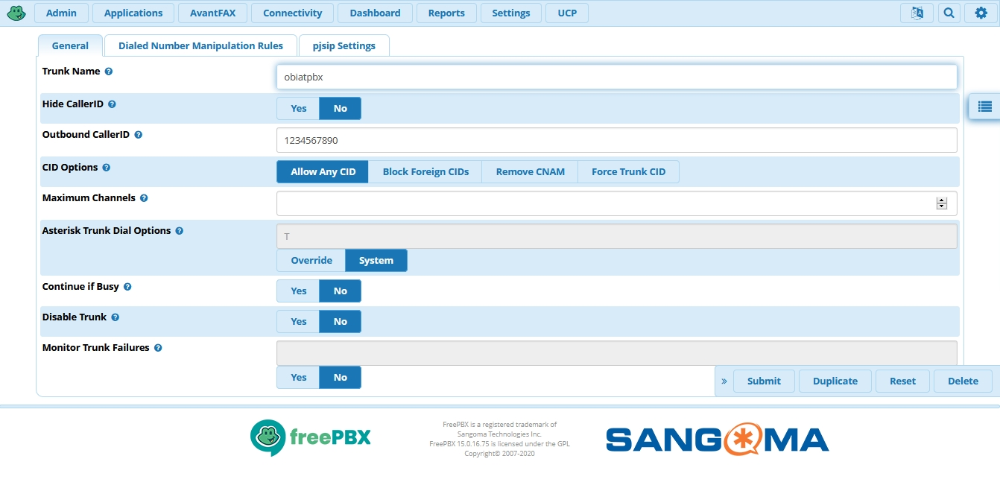
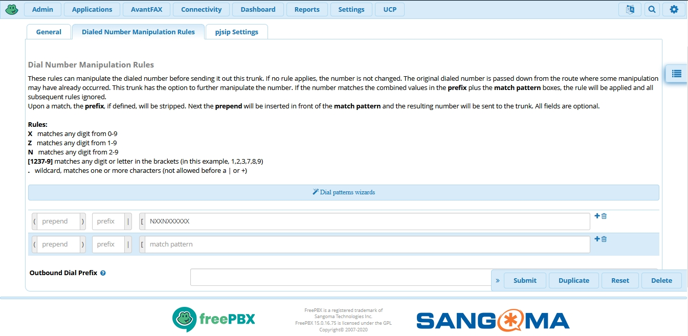

**Add your public ip address of your obi ATA device/router**

**Add SIP Credentials that was set on the obi ATA device/router**
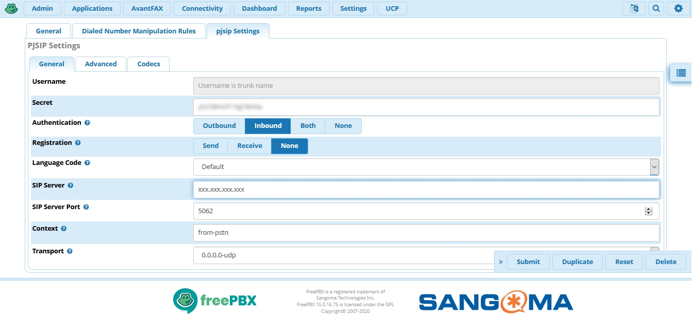
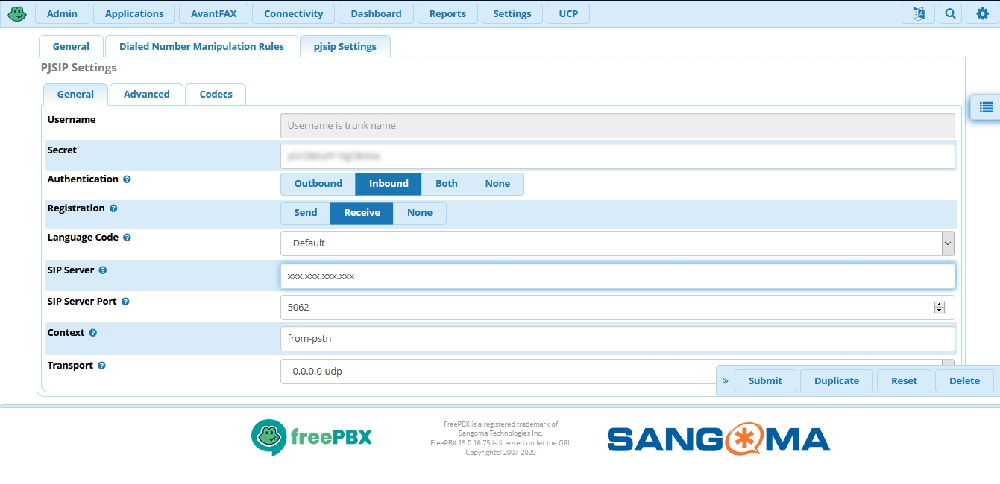
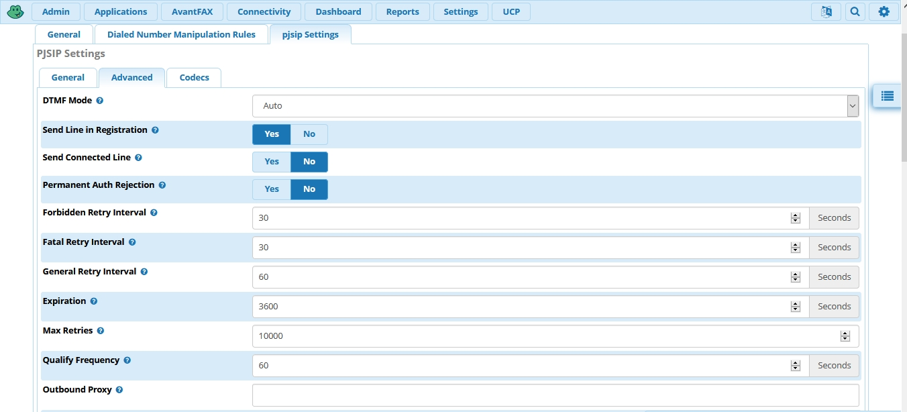
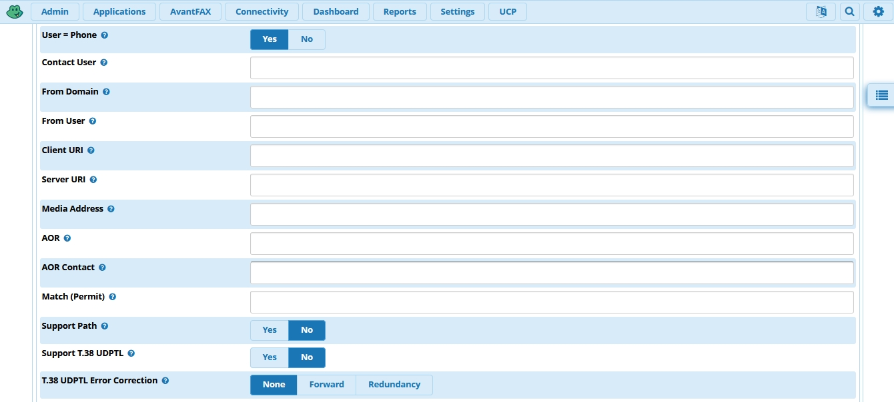
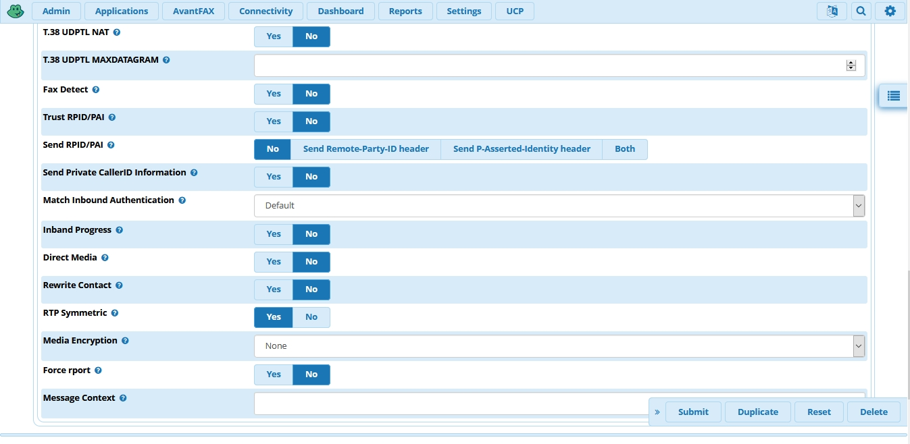

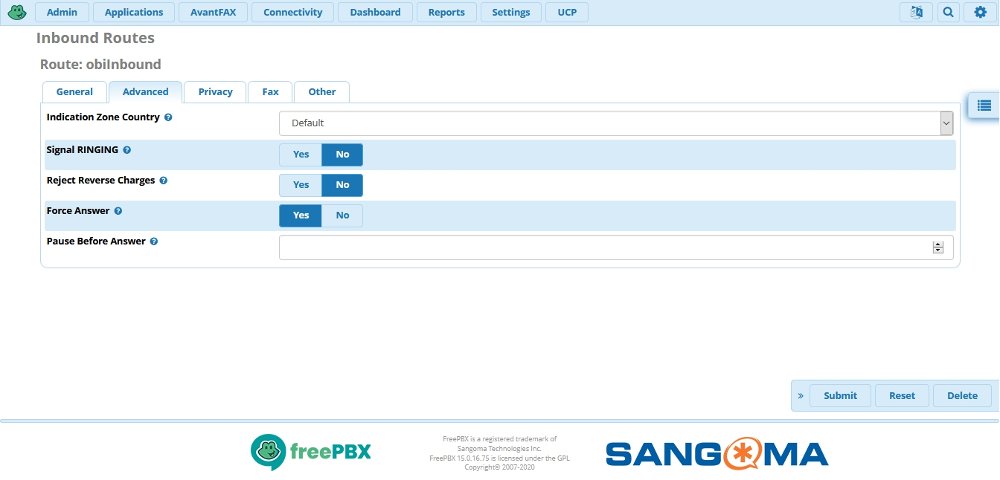
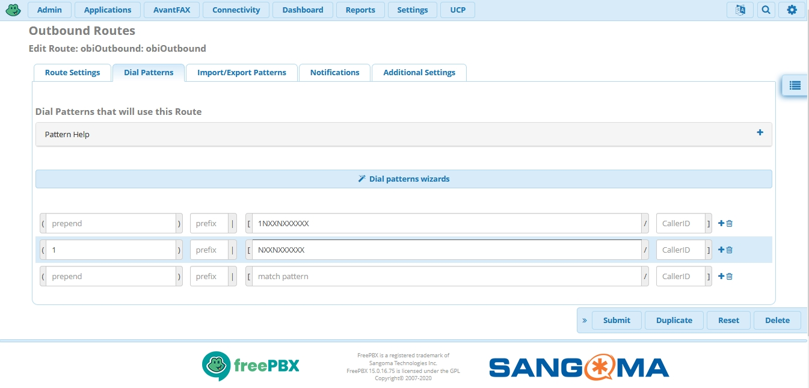

Insure you have all items in red **"!"** are changed/edited to match.
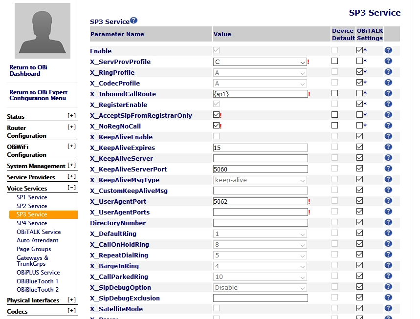

**Add your FreePBX Server IP address/URI and create SIP Credentials**
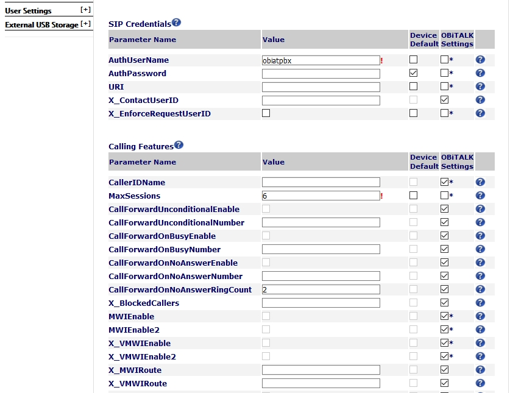
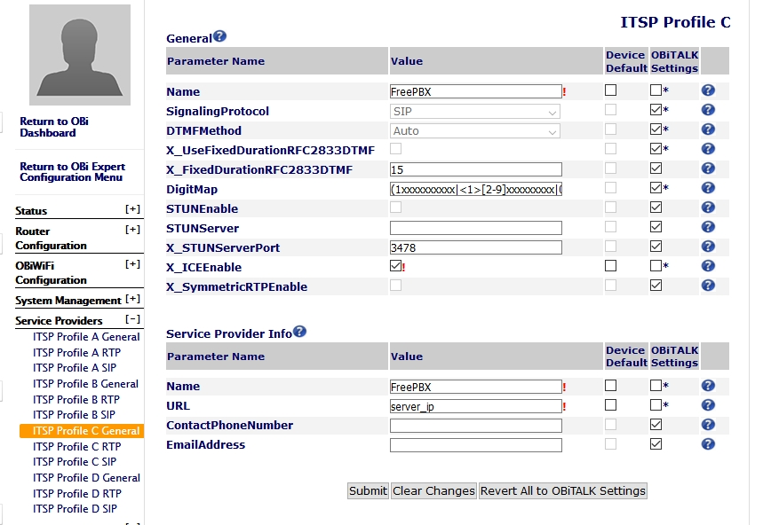
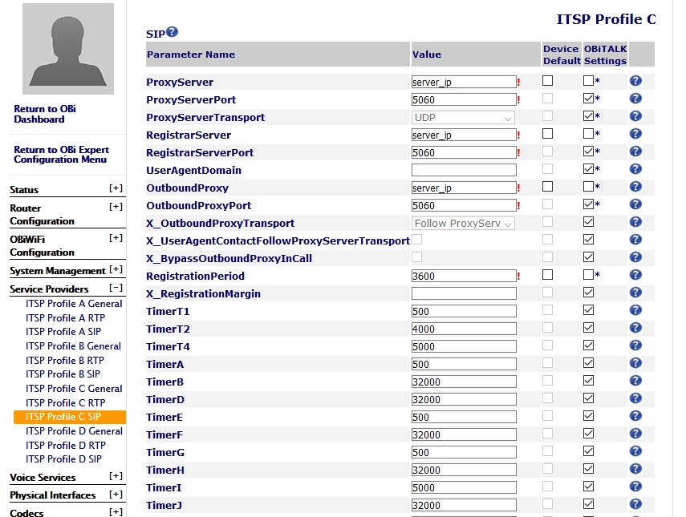
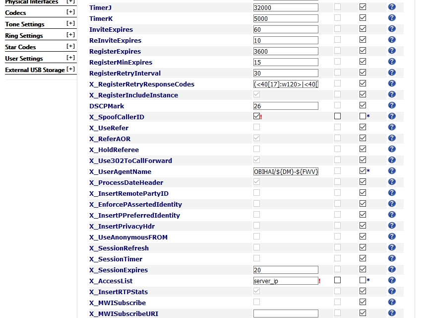
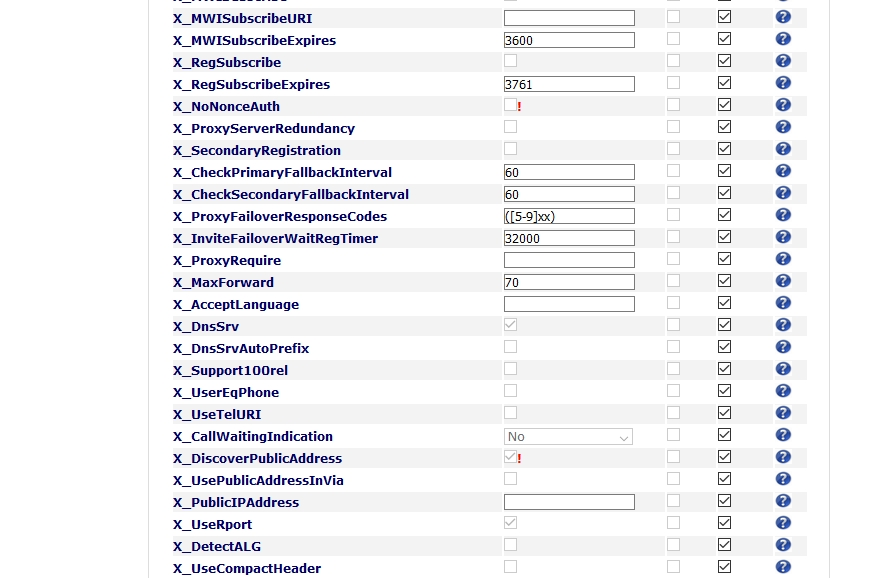

**Test calling out before making this final change. Adding your Google Voice number**
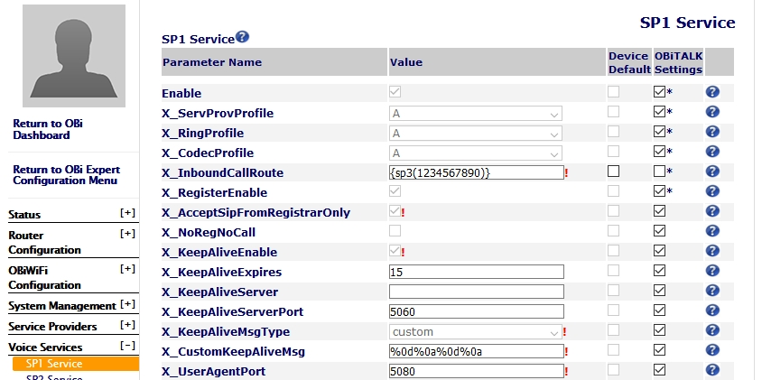

>Make sure to change setting at Google Voice website to have calls going only to your Obi ATA device, not to any other phone or device.
